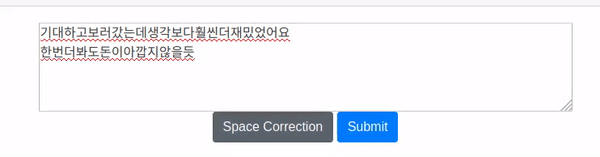
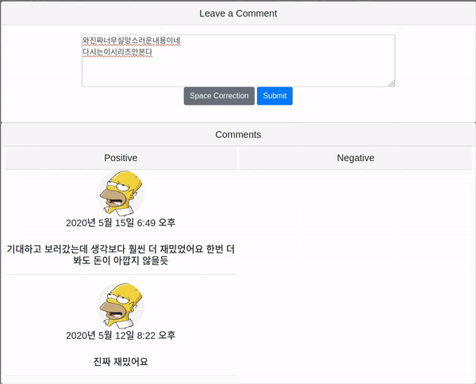
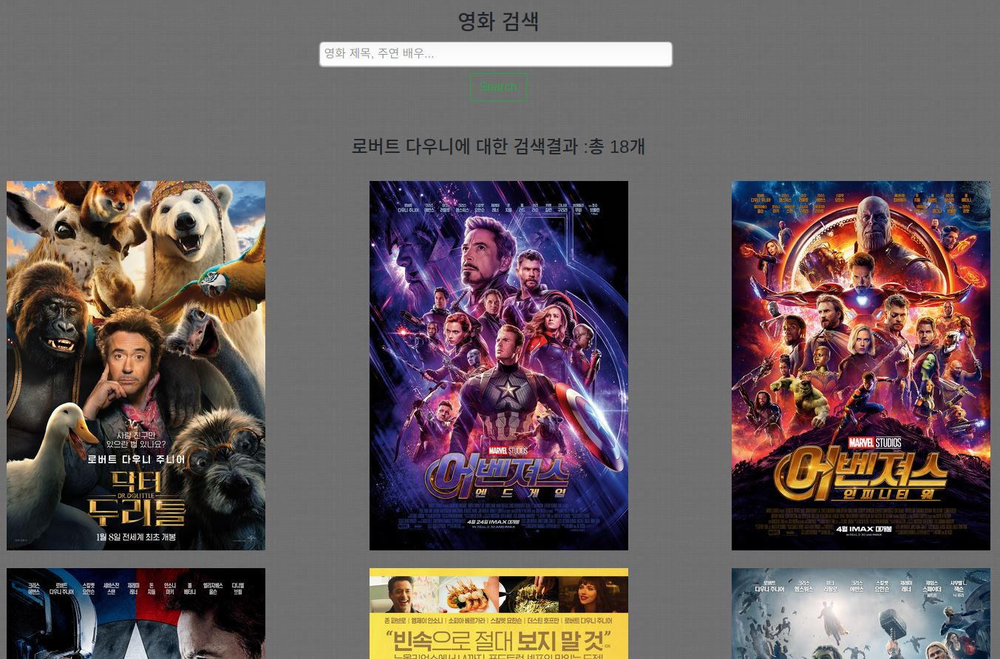
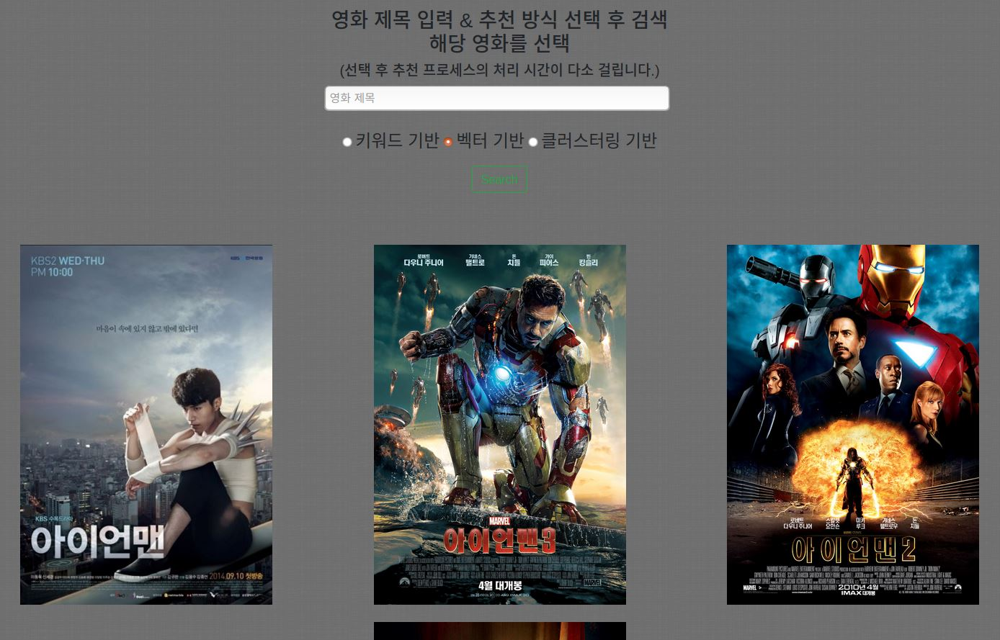
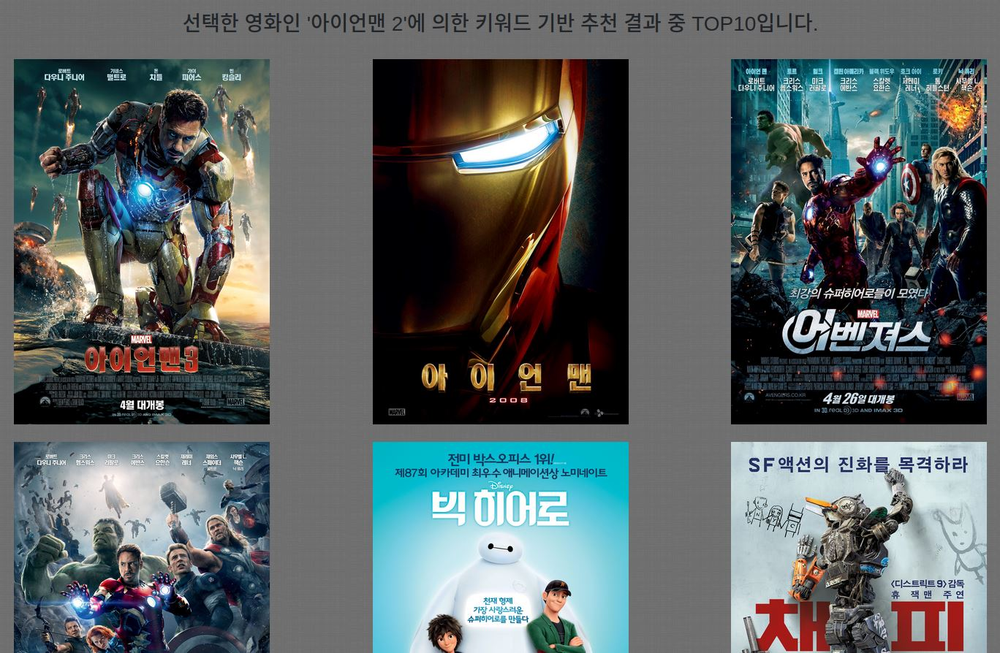

## Machine's Choice (of movie)

영화 추천 및 영화별 리뷰 페이지

### Overview / Motivation

머신러닝으로 작동되는 기능들로만 이루어진 페이지를 만들어보고자 하여 이전에 진행한 [영화 추천](https://github.com/jbose038/naver-movie-recommendation)을 기반으로 
추가적인 기능들을 몇 개 더하여 Django 기반 웹페이지를 제작하였습니다. 
주요 페이지는 영화 검색과 영화 추천 페이지를 가지고 있습니다. 
영화 검색 페이지에선 영화 제목과 주연 배우명을 검색할 수 있고 해당되는 영화의 포스터들이 결과로 나오게 됩니다.

각 포스터를 클릭하게 될 경우 해당 영화의 상세 페이지로 이동하여 그 영화에 대한 다양한 정보와 
다른 사용자들의 리뷰를 볼 수 있습니다.

영화 추천 페이지에선 영화 제목을 입력하고 추천 방식을 선택하여 검색한 후 해당 영화의 포스터를 클릭할 경우 
선택한 추천 방식(키워드/벡터/클러스터링)을 기반으로 추천 시스템을 실행하여 상위 10개의 영화인 TOP10을 
결과로 보여주게 됩니다.

### Features

1. 띄어쓰기 교정 - CRF(Conditional Random Field)

   작성한 코멘트(리뷰)에 대해 CRF 모델이 적용되어 띄어쓰기 교정 기능을 제공하고 있습니다. 
   CRF모델은 python-crfsuite를 사용하여 생성되었습니다. 
   (업로드시 파일당 100MB 용량 제한으로 crf 모델(248MB)은 포함되어 있지 않습니다.)

   CRF는 딥러닝이 사용되기 전에 널리 사용되던 sequential labeling 문제에 대한 알고리즘입니다. 
   이 알고리즘이 사용되기 전엔 Maximum Entropy Model, Maximum Entropy Markov Model 등이 사용되었으며 
   이들의 단점인 전체적으로 보지 않고 일부를 보는 점을 보완한 알고리즘입니다. 
   그래서 CRF는 이전 시점의 정보들이 아닌 다양한 시점의 정보들을 활용하여 생성된 여러 sequence들에 대하여 
   이들 중 가장 적합한 하나의 label을 선택합니다. 
   따라서 이는 softmax regression의 일종이며 입력에 대해 같은 길이의 label sequence를 출력합니다.

   

   

2. 영화 추천 - Textrank, TF-IDF, K-Means

   줄거리를 주요 기반으로 하며 여러 정보들을 활용하여 진행하였고 이를 해석하는 데에 있어서 여러 방식으로 접근하였습니다. 
   (참고 : [줄거리를 활용한 네이버 영화 추천에 대한 다양한 접근 방식](https://github.com/jbose038/naver-movie-recommendation))

   성능 및 처리 속도는 키워드 >= 벡터 > 클러스터링입니다.

   

3. 리뷰 감정 분석 - CharCNN, bi-LSTM

   해당 영화에 대하여 여러 리뷰들 중 긍정적인 리뷰와 부정적인 리뷰들을 분리하여 
   각각 따로 볼 수 있게 하였습니다. 
   리뷰의 감성 분석에 대하여 딥러닝 기반 문장 단위 모델과 단어 단위 모델을 각각 하나씩 사용하였습니다.

   훈련 데이터 : 네이버 영화 리뷰 데이터를 사용하였습니다.

   모델은 Character-level CNN + bi-LSTM, Word-level Embedding + bi-LSTM 두 모델로 이루어진 
   Average Ensemble 모델을 사용하고 있습니다.

   지표 : 
   F1-score = 0.8503(char-level) + 0.8548(word-level) => 0.8684(ensemble) 
   Accuracy = 0.8526(char-level) + 0.8495(word-level) => 0.8650(ensemble)

   전처리 : 
   ※ Word-level 
   Konlpy 내 tagger인 Okt 모델을 사용하여 문장 내 단어들의 morphing을 진행하였습니다. 
   훈련 데이터 내 vocab_size는 43,752개 이며 이 중 상위 30,000개의 vocab을 사용하여 tokenize 하였습니다. 
   훈련 데이터 내 리뷰의 평균 단어 수 는 10.6개이고 최대 69개까지 등장하여 sequence의 고정 길이는 
   70으로 하였고 성능에 지장이 가지 않도록 앞에서부터 padding을 진행하였습니다.

   ※ Character-level 
   word-level을 사용하게 되면 vocab_size에 따라 덜 중요한 단어들이 사용되지 않거나 
   OOV(Out-Of-Vocabulary)에 대응할 수 없게 됩니다. 
   그래서 문장을 문자 단위로 전처리하여 최대한 모든 의미를 유지하면서, 리뷰 특성상 개인마다 단어사용이 
   다양하고 오타도 종종 발생하기 때문에 이러한 점들에 대해 유연하게 대처할 수 있는 모델을 만들어보고자 
   문자 단위 임베딩 모델도 사용하게 되었습니다.

   

### Metrics

리뷰 감성 분석에 사용된 모델들에 대한 지표

| SENTIMENT_MODEL_NAME                | Accuracy score |   F1 score    |
| :---------------------------------- | :------------: | :-----------: |
| CharCNN                             |     0.8526     |    0.8503     |
| Bi-LSTM( word )                     |     0.8495     |    0.8548     |
| Bi-LSTM( char )                     |     0.8446     |    0.8451     |
| CharCNN+Bi-LSTM( char ) - ensemble1 |     0.8601     |    0.8634     |
| CharCNN+Bi-LSTM( word ) - ensemble2 |     0.8650     |    0.8684     |
| Naive Bayes( word ) - tfidf/count   | 0.8376/0.8433  | 0.8445/0.8490 |

#### Accuracy

ensemble1 > ensemble2 > CharCNN > Bi-LSTM(word) > Bi-LSTM(char) > Naive Bayes

#### F1 score

ensemble2 > ensemble1 > Bi-LSTM(word) > CharCNN > Naive Bayes > Bi-LSTM(char)

#### Result

Best model : CharCNN+Bi-LSTM( word ) - ensemble2

### Page ScreenShots

<b>영화 검색</b>

<b>영화 추천 - 검색</b>

<b>영화 추천 - 결과</b>

